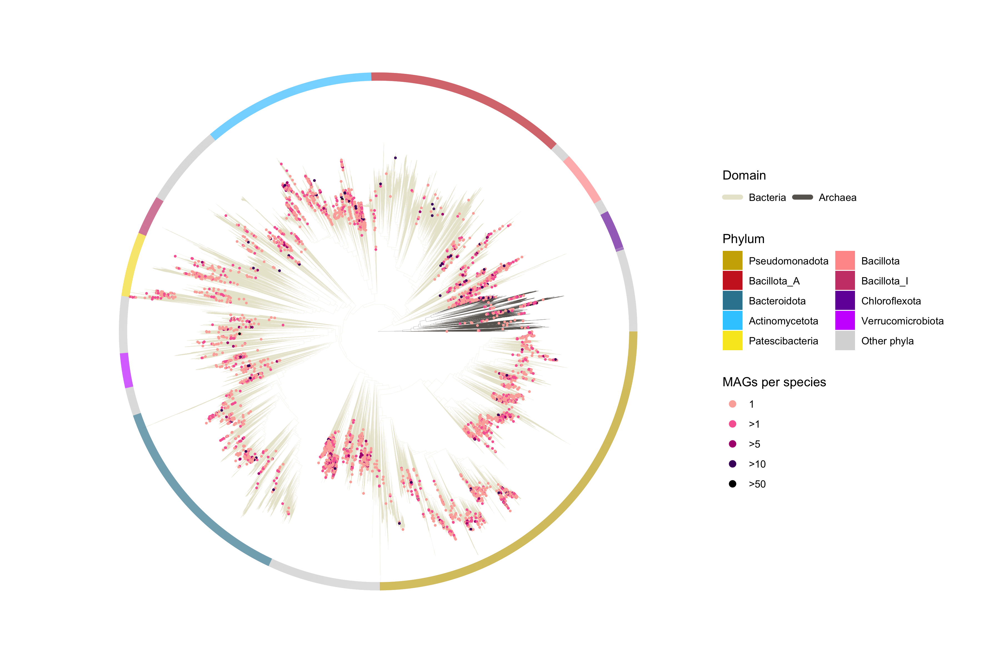

Plotting a phylogenetic tree with GTDB and MFD short-read genomes
================
By Mantas Sereika, Aalborg University, 2024

#### Load dependencies

``` r
library(tidyverse)
library(stringr)
library(ggtree)
library(ggtreeExtra)
library(treeio)
library(ggnewscale)
library(svglite)
```

#### Load tree data and metadata

``` r
tree <- read.tree("../analysis/datasets/gtdb-shallow.tree")
mags <- read.delim("../analysis/datasets/mfd-sr-mags_meta.tsv", sep="\t", header=T)
gtdb <- read.delim("../analysis/datasets/gtdb-r220_meta.tsv", sep="\t", header=T)
```

#### Initial wrangling of tree metadata

``` r
# Get tips
tips <- as.data.frame(unique(tree$tip.label))
mags_id <- as.data.frame(str_subset(tips[,1], "LIB"))
colnames(mags_id) <- "label"

# Prune
gtdb_sub_ <- as.data.frame(gtdb[, c("label")])
colnames(gtdb_sub_) <- "label"
sub <- as.data.frame(rbind(gtdb_sub_,mags_id))
tree <- ape::keep.tip(tree, c(as.character(sub$label)))

# Mark higher taxonomies
tree_df <- tree %>% as.treedata %>% as_tibble
tree <- groupClade(tree, .node=c(tree_df[(tree_df$label == "Prokaryotes"), ]$node,
                                 tree_df[(tree_df$label == "Archaea"), ]$node))
```

#### Add number of bins per species cluster

``` r
mags$label <- mags$bin
label_phyla <- as.data.frame(rbind(mags[, c("label","phylum")],
                                   gtdb[, c("label","phylum")]))

label_phyla <- merge(label_phyla,mags[, c("label","bins_n")],by="label", all=TRUE)
label_phyla$bins_n_ <- ifelse(label_phyla$bins_n == 1, "1",
                       ifelse(label_phyla$bins_n <= 5, ">1",
                       ifelse(label_phyla$bins_n <= 10, ">5",
                       ifelse(label_phyla$bins_n <= 50, ">10",">50"))))

label_phyla$bins_n_ <- factor(label_phyla$bins_n_, levels = rev(c(">50",">10",">5",">1","1")))
label_phyla <- label_phyla[order(label_phyla$bins_n_, decreasing=TRUE),]
label_phyla[,"MAGs per species"] <- label_phyla$bins_n_
```

#### Mark abundant phyla

``` r
gtdb_count <- aggregate(gtdb$label, by=list(gtdb$phylum), FUN=length)
colnames(gtdb_count) <- c("phylum", "gtdb_species")

abund_phyla <- as.data.frame(head(gtdb_count[order(gtdb_count$gtdb_species,
                                                       decreasing = TRUE),]$phylum,9))
colnames(abund_phyla)[1] <- "phylum"

label_phyla$phylum_ <- ifelse((label_phyla$phylum %in% abund_phyla$phylum),
                               label_phyla$phylum,"Other phyla")

list_phyla <- c(abund_phyla$phylum,"Other phyla")
```

#### Plot tree

``` r
plot_tree <- ggtree(tree, layout="circular", aes(color=group), lwd=0.05) %<+% label_phyla +
             scale_color_manual(values=c("#e9e6d3", "#68645f"), labels=c("Bacteria","Archaea")) +
             geom_point2(aes(subset=(label %in% mags$bin),fill=`MAGs per species`), 
                         shape=21, size=1.1, stroke = 0) +  
             scale_fill_manual(values=c("1"="#fbafa8",
                                        ">1"="#f768a1",
                                        ">5"="#ae017e",
                                        ">10"="#49006a",
                                        ">50"="#000000"))  +
             guides(fill = guide_legend(override.aes = list(size = 3)),
                    color = guide_legend(order=1, ncol=2, title="Domain",
                                         override.aes = list(shape=NA, linewidth=2))) + 
             new_scale_fill() + 
             geom_fruit(geom = geom_tile, width=0.1, pwidth=0.08, offset=-0.1, 
                        mapping = aes(y=label, x=1, fill=phylum_)) +
             scale_fill_manual(values=c("#cdad00","#cd2626","#32849f","#33ccff",
                                        "#F8E622","#ff9999","#CC4678FF","#7301A8FF",
                                        "#cc33ff","#d9d9d9"), breaks=list_phyla) + 
             guides(fill=guide_legend(order=2, title="Phylum", ncol=2))

plot_tree
```

<!-- -->

``` r
ggsave("../analysis/plots/gtdb-tree_mfd-sr.svg", width=12, height=8, units="in", device="svg")
```
